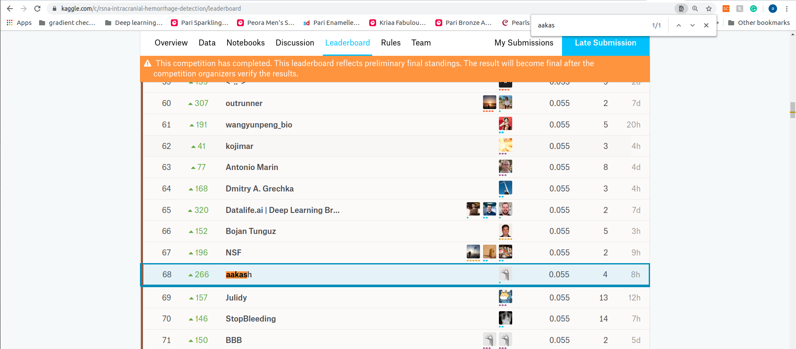

# RSNA Intracranial Hemorrhage Detection

- This model came at 68th position

 	
# Model Overview

- The model consist of ensemble of SE-Resnext50 with MISH activation, SE-Resnext101 with MISH activation and Octave-Resnet50 using Nvidia-apex

# How to run it

- Run ./bin/preprocess.sh
- Run ./bin/train001.sh
- Run ./bin/predict.sh

# Weights

-TBA
